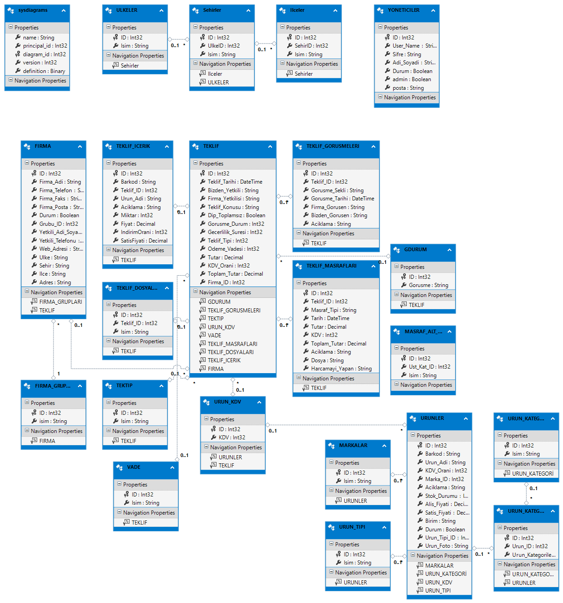

# CRM with Spring Boot Project

*In progress*

### Overview
This is an open-source Customer Relationship Management (CRM) system. The project is still under development. Contributions are welcome. If you want to contribute, you can open a [pull request](/README.md/#Contributing).

### Technologies

<code></code>
<code></code>
<code></code>
<code></code>
<code></code>
<code></code>
<code></code>
<code></code>
<code></code>
<code></code>
<code></code>
<code></code>

### Features

- Recording and managing customer information
- Create and manage offers
- Recording and tracking expenses
- Product and category management
- Interview and meeting records
- Email and phone-based customer search
- Full CRUD operations for customers

### Entity Diagram



### Requirements

- Java 21+
- PostgreSQL 16
- IntelliJ IDEA (or other IDE)

### Installation

1. Clone the repository:
   ```bash
    git clone https://github.com/your-username/crm-spring-boot.git
    ```
    ```bash
    cd crm-spring-boot
    ```
2. Configure the database:

    Create a PostgreSQL database named `crm`. Update the `application.properties` file with your database username and password
    ```
    spring.datasource.url=jdbc:postgresql://localhost:5432/crm
    spring.datasource.username=your_username
    spring.datasource.password=your_password
    ```
3. Build the project:
    ```bash
    mvn clean install
    ```
4. Run the project:
    ```bash
    mvn spring-boot:run
    ```
5. Usage:
   Once the application is running, you can access the API documentation at:
    ```bash
    http://localhost:8080/swagger-ui.html
    ```

### Contributing
- Fork the repository.
- Create your feature branch: `git checkout -b feature/your-feature`
- Commit your changes: `git commit -m 'Add some feature'`
- Push to the branch: `git push origin feature/your-feature`
- Open a pull request.

### License
This project is licensed under the [MIT](https://choosealicense.com/licenses/mit/) License.